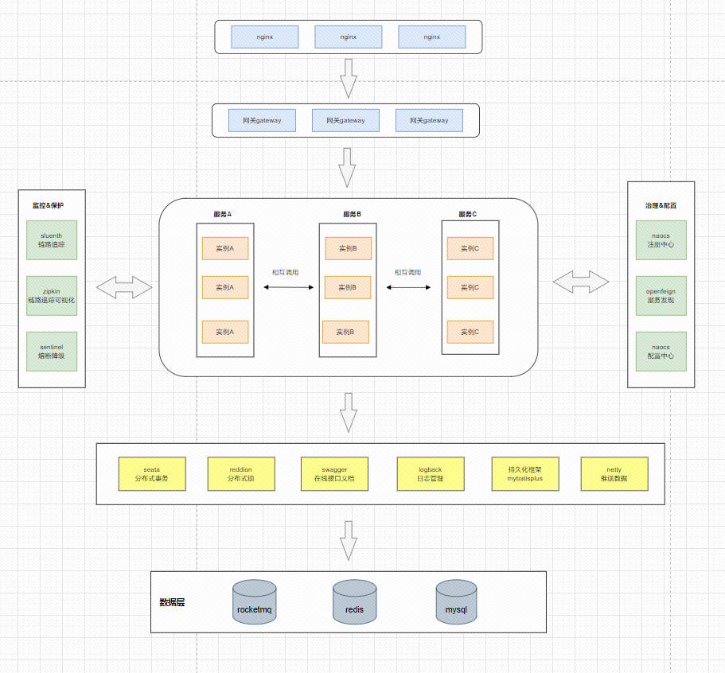

## 系统架构图


## 目录结构

```
otc-server
├─api -- 内网接口
│  ├─api-system  -- 系统对内接口
│  └─api-user  -- 用户对内接口
├─bussiness  -- 交易模块
├─client -- 客户端api
├─common -- 一些公共的方法
│  ├─common-cache  -- 缓存相关公共代码
│  ├─common-core  -- 公共模块核心（公共中的公共代码）
│  ├─common-database  -- 数据库连接相关公共代码
│  ├─common-rocketmq  -- rocketmq相关公共代码
│  ├─common-jni  -- 调用so公共代码
│  └─common-security  -- 登录权限认证
├─dm   -- 数据管理
├─doc  -- 项目相关文档
├─gateway  -- 网关
├─market -- 营销模块
├─netty  -- 向客户端推送数据
├─quote  -- 报价模块
├─risk   -- 风险管理
├─supervise -- 监管模块
├─system  -- 系统模块
└─user  -- 用户模块
```
