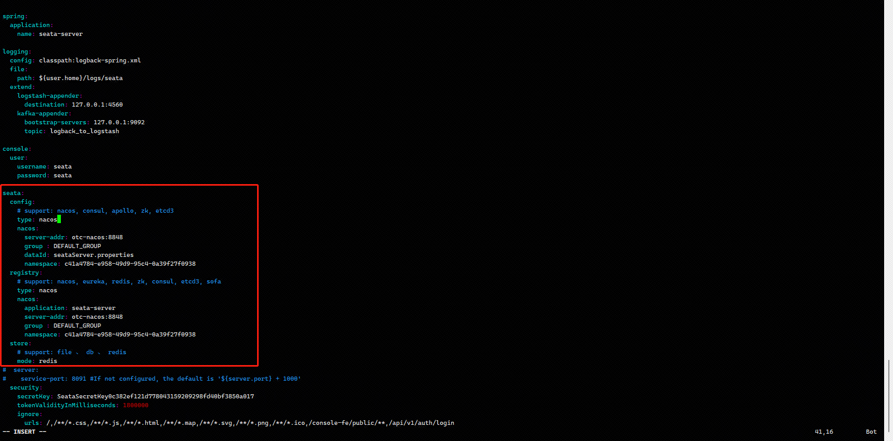

## 安装工具
apt-get install lrzsz

apt install unzip

## JDK8安装
cd /home/java

上传jdk-8u351-linux-x64.tar.gz

tar -zxvf jdk-8u351-linux-x64.tar.gz

vim /etc/profile
```
在结尾添加
export JAVA_HOME=/home/local/java/jdk1.8.0_351
export CLASSPATH=.:$JAVA_HOME/lib/tools.jar
export PATH=$JAVA_HOME/bin:$PATH
```
java -version

## 安装maven
cd /usr/local

上传apache-maven-3.8.6-bin.tar.gz

tar -zxvf apache-maven-3.8.6-bin.tar.gz

vim /etc/profile
```
在结尾添加
export MAVEN_HOME=/usr/local/apache-maven-3.8.4
export PATH=$MAVEN_HOME/bin:$PATH
```
mvn -v

## nacos安装
上传nacos-server-2.2.0.zip到/opt/soft

mysql执行 /opt/soft/nacos/conf/mysql-schema.sql

unzip /opt/soft/nacos-server-2.2.0.zip

mv cluster.conf.example cluster.conf

vim /opt/soft/nacos/conf/applicaiton.properties
```
spring.datasource.platform=mysql
### Count of DB:
db.num=1
### Connect URL of DB:
db.url.0=jdbc:mysql://otc-mysql:3306/nacos?characterEncoding=utf8&connectTimeout=1000&socketTimeout=3000&autoReconnect=true&useUnicode=true&useSSL=false&serverTimezone=UTC
db.user.0=DBAdmin
db.password.0=Midnight001!@#$
```
启动
bash startup.sh

关闭
bash shutdown.sh

## zipkin安装
curl -sSL https://zipkin.io/quickstart.sh | bash -s

mysql中创建脚本
```
CREATE TABLE IF NOT EXISTS zipkin_spans (
  `trace_id_high` BIGINT NOT NULL DEFAULT 0 COMMENT 'If non zero, this means the trace uses 128 bit traceIds instead of 64 bit',
  `trace_id` BIGINT NOT NULL,
  `id` BIGINT NOT NULL,
  `name` VARCHAR(255) NOT NULL,
  `remote_service_name` VARCHAR(255),
  `parent_id` BIGINT,
  `debug` BIT(1),
  `start_ts` BIGINT COMMENT 'Span.timestamp(): epoch micros used for endTs query and to implement TTL',
  `duration` BIGINT COMMENT 'Span.duration(): micros used for minDuration and maxDuration query',
  PRIMARY KEY (`trace_id_high`, `trace_id`, `id`)
) ENGINE=InnoDB ROW_FORMAT=COMPRESSED CHARACTER SET=utf8 COLLATE utf8_general_ci;
 
ALTER TABLE zipkin_spans ADD INDEX(`trace_id_high`, `trace_id`) COMMENT 'for getTracesByIds';
ALTER TABLE zipkin_spans ADD INDEX(`name`) COMMENT 'for getTraces and getSpanNames';
ALTER TABLE zipkin_spans ADD INDEX(`remote_service_name`) COMMENT 'for getTraces and getRemoteServiceNames';
ALTER TABLE zipkin_spans ADD INDEX(`start_ts`) COMMENT 'for getTraces ordering and range';
 
CREATE TABLE IF NOT EXISTS zipkin_annotations (
  `trace_id_high` BIGINT NOT NULL DEFAULT 0 COMMENT 'If non zero, this means the trace uses 128 bit traceIds instead of 64 bit',
  `trace_id` BIGINT NOT NULL COMMENT 'coincides with zipkin_spans.trace_id',
  `span_id` BIGINT NOT NULL COMMENT 'coincides with zipkin_spans.id',
  `a_key` VARCHAR(255) NOT NULL COMMENT 'BinaryAnnotation.key or Annotation.value if type == -1',
  `a_value` BLOB COMMENT 'BinaryAnnotation.value(), which must be smaller than 64KB',
  `a_type` INT NOT NULL COMMENT 'BinaryAnnotation.type() or -1 if Annotation',
  `a_timestamp` BIGINT COMMENT 'Used to implement TTL; Annotation.timestamp or zipkin_spans.timestamp',
  `endpoint_ipv4` INT COMMENT 'Null when Binary/Annotation.endpoint is null',
  `endpoint_ipv6` BINARY(16) COMMENT 'Null when Binary/Annotation.endpoint is null, or no IPv6 address',
  `endpoint_port` SMALLINT COMMENT 'Null when Binary/Annotation.endpoint is null',
  `endpoint_service_name` VARCHAR(255) COMMENT 'Null when Binary/Annotation.endpoint is null'
) ENGINE=InnoDB ROW_FORMAT=COMPRESSED CHARACTER SET=utf8 COLLATE utf8_general_ci;
 
ALTER TABLE zipkin_annotations ADD UNIQUE KEY(`trace_id_high`, `trace_id`, `span_id`, `a_key`, `a_timestamp`) COMMENT 'Ignore insert on duplicate';
ALTER TABLE zipkin_annotations ADD INDEX(`trace_id_high`, `trace_id`, `span_id`) COMMENT 'for joining with zipkin_spans';
ALTER TABLE zipkin_annotations ADD INDEX(`trace_id_high`, `trace_id`) COMMENT 'for getTraces/ByIds';
ALTER TABLE zipkin_annotations ADD INDEX(`endpoint_service_name`) COMMENT 'for getTraces and getServiceNames';
ALTER TABLE zipkin_annotations ADD INDEX(`a_type`) COMMENT 'for getTraces and autocomplete values';
ALTER TABLE zipkin_annotations ADD INDEX(`a_key`) COMMENT 'for getTraces and autocomplete values';
ALTER TABLE zipkin_annotations ADD INDEX(`trace_id`, `span_id`, `a_key`) COMMENT 'for dependencies job';
 
CREATE TABLE IF NOT EXISTS zipkin_dependencies (
  `day` DATE NOT NULL,
  `parent` VARCHAR(255) NOT NULL,
  `child` VARCHAR(255) NOT NULL,
  `call_count` BIGINT,
  `error_count` BIGINT,
  PRIMARY KEY (`day`, `parent`, `child`)
) ENGINE=InnoDB ROW_FORMAT=COMPRESSED CHARACTER SET=utf8 COLLATE utf8_general_ci;
```
nohup java -jar zipkin.jar --STORAGE_TYPE=mysql --MYSQL_HOST=otc-mysql --MYSQL_TCP_PORT=3306 --MYSQL_USER=DBAdmin --MYSQL_PASS=Midnight001!@#$ --MYSQL_DB=zipkin &

## Rocketmq

上传rocketmq-all-5.0.0-bin-release.zip到/opt/soft/rocketmq
unzip rocketmq-all-5.0.0-bin-release.zip
cd /opt/soft/rocketmq/rocketmq-all-5.0.0-bin-release
```
mkdir bin/logs
启动nameserver
nohup sh bin/mqnamesrv >bin/logs/nameserver.log 2>&1 &

启动broker
nohup sh bin/mqbroker -n localhost:9876 -c conf/broker.conf > bin/logs/broker.log  2>&1 &

关闭
sh bin/mqshutdown namesrv
sh bin/mqshutdown broker
```

### rocketmq客户端
上传rocketmq-dashboard-master.zip到/opt/soft/解压
```
cd /opt/soft/rocketmq-dashboard-master
mvn clean package -Dmaven.test.skip=true
nohup java -jar target/rocketmq-dashboard-1.0.1-SNAPSHOT.jar --server.port=8088 &
```
访问地址
http://nameserver:8088

## seata
上传seata-server-1.6.1.zip到/opt/soft/解压

修改配置文件


nacos新增配置seataServer.properties
```
#For details about configuration items, see https://seata.io/zh-cn/docs/user/configurations.html
#Transport configuration, for client and server
transport.type=TCP
transport.server=NIO
transport.heartbeat=true
transport.enableTmClientBatchSendRequest=false
transport.enableRmClientBatchSendRequest=true
transport.enableTcServerBatchSendResponse=false
transport.rpcRmRequestTimeout=30000
transport.rpcTmRequestTimeout=30000
transport.rpcTcRequestTimeout=30000
transport.threadFactory.bossThreadPrefix=NettyBoss
transport.threadFactory.workerThreadPrefix=NettyServerNIOWorker
transport.threadFactory.serverExecutorThreadPrefix=NettyServerBizHandler
transport.threadFactory.shareBossWorker=false
transport.threadFactory.clientSelectorThreadPrefix=NettyClientSelector
transport.threadFactory.clientSelectorThreadSize=1
transport.threadFactory.clientWorkerThreadPrefix=NettyClientWorkerThread
transport.threadFactory.bossThreadSize=1
transport.threadFactory.workerThreadSize=default
transport.shutdown.wait=3
transport.serialization=seata
transport.compressor=none

#Transaction routing rules configuration, only for the client
service.vgroupMapping.default_tx_group=default
#If you use a registry, you can ignore it
service.default.grouplist=127.0.0.1:8091
service.enableDegrade=false
service.disableGlobalTransaction=false

#Transaction rule configuration, only for the client
client.rm.asyncCommitBufferLimit=10000
client.rm.lock.retryInterval=10
client.rm.lock.retryTimes=30
client.rm.lock.retryPolicyBranchRollbackOnConflict=true
client.rm.reportRetryCount=5
client.rm.tableMetaCheckEnable=true
client.rm.tableMetaCheckerInterval=60000
client.rm.sqlParserType=druid
client.rm.reportSuccessEnable=false
client.rm.sagaBranchRegisterEnable=false
client.rm.sagaJsonParser=fastjson
client.rm.tccActionInterceptorOrder=-2147482648
client.tm.commitRetryCount=5
client.tm.rollbackRetryCount=5
client.tm.defaultGlobalTransactionTimeout=60000
client.tm.degradeCheck=false
client.tm.degradeCheckAllowTimes=10
client.tm.degradeCheckPeriod=2000
client.tm.interceptorOrder=-2147482648
client.undo.dataValidation=true
client.undo.logSerialization=jackson
client.undo.onlyCareUpdateColumns=true
server.undo.logSaveDays=7
server.undo.logDeletePeriod=86400000
client.undo.logTable=undo_log
client.undo.compress.enable=true
client.undo.compress.type=zip
client.undo.compress.threshold=64k
#For TCC transaction mode
tcc.fence.logTableName=tcc_fence_log
tcc.fence.cleanPeriod=1h

#Log rule configuration, for client and server
log.exceptionRate=100

#Transaction storage configuration, only for the server. The file, db, and redis configuration values are optional.
store.mode=redis
#store.lock.mode=redis
#store.session.mode=redis
#Used for password encryption
store.publicKey=

#If `store.mode,store.lock.mode,store.session.mode` are not equal to `file`, you can remove the configuration block.
store.file.dir=file_store/data
store.file.maxBranchSessionSize=16384
store.file.maxGlobalSessionSize=512
store.file.fileWriteBufferCacheSize=16384
store.file.flushDiskMode=async
store.file.sessionReloadReadSize=100

#These configurations are required if the `store mode` is `db`. If `store.mode,store.lock.mode,store.session.mode` are not equal to `db`, you can remove the configuration block.
store.db.datasource=druid
store.db.dbType=mysql
store.db.driverClassName=com.mysql.cj.jdbc.Driver
store.db.url=jdbc:mysql://otc-mysql:3306/seata?useUnicode=true&rewriteBatchedStatements=true
store.db.user=DBAdmin
store.db.password=Midnight001!@#$
store.db.minConn=5
store.db.maxConn=30
store.db.globalTable=global_table
store.db.branchTable=branch_table
store.db.distributedLockTable=distributed_lock
store.db.queryLimit=100
store.db.lockTable=lock_table
store.db.maxWait=5000

#These configurations are required if the `store mode` is `redis`. If `store.mode,store.lock.mode,store.session.mode` are not equal to `redis`, you can remove the configuration block.
store.redis.mode=single
store.redis.single.host=otc-redis
store.redis.single.port=6379
store.redis.sentinel.masterName=
store.redis.sentinel.sentinelHosts=
store.redis.maxConn=10
store.redis.minConn=1
store.redis.maxTotal=100
store.redis.database=1
store.redis.password=
store.redis.queryLimit=100

#Transaction rule configuration, only for the server
server.recovery.committingRetryPeriod=1000
server.recovery.asynCommittingRetryPeriod=1000
server.recovery.rollbackingRetryPeriod=1000
server.recovery.timeoutRetryPeriod=1000
server.maxCommitRetryTimeout=-1
server.maxRollbackRetryTimeout=-1
server.rollbackRetryTimeoutUnlockEnable=false
server.distributedLockExpireTime=10000
server.xaerNotaRetryTimeout=60000
server.session.branchAsyncQueueSize=5000
server.session.enableBranchAsyncRemove=false
server.enableParallelRequestHandle=false

#Metrics configuration, only for the server
metrics.enabled=false
metrics.registryType=compact
metrics.exporterList=prometheus
metrics.exporterPrometheusPort=9898
```
启动：bash bin/seata-server.sh 
JAVA_NOTFOUND 解决方式： export JAVA_HOME=/home/local/java/jdk1.8.0_351

## nginx安装
```
安装依赖：
sudo apt-get install libpcre3 libpcre3-dev
sudo apt-get install zlib1g-dev
sudo apt-get install openssl libssl-dev

上传nginx-1.20.2.tar.gz到/opt/soft/解压
cd /opt/soft/
mv nginx-1.20.2 nginx
cd nginx
./configure --with-http_ssl_module --with-http_v2_module --with-http_stub_status_module
sudo make -j32
sudo make install

验证 nginx 是否安装成功：
/usr/local/nginx/sbin/nginx -v
```
启动：
sudo /usr/local/nginx/sbin/nginx

## 服务部署
以user模块举例
cd /opt/soft/otc/user
上传user模块的jar包
vim start.sh
```
#!/usr/bin/env sh
cd /opt/soft/otc/user
nohup java -Dspring.profiles.active=dev -Dspring.cloud.nacos.config.namespace=f80af0a8-f46b-413d-b390-e9dc3691ae70 -Dspring.cloud.nacos.discovery.namespace=f80af0a8-f46b-413d-b390-e9dc3691ae70  -jar user-1.0-SNAPSHOT.jar  >> /opt/soft/otc/user/nohup.out &
```
设置开机自启动
```shell
# 创建服务文件
vi /usr/lib/systemd/system/otc-user.service 
# 输入以下内容
```

```shell
[Unit]
Description=otc-user
After=network.target

[Service]
Type=forking
ExecStart=/bin/bash /opt/soft/otc/user/start.sh
ExecStop=/bin/kill -s QUIT $MAINPID

[Install]
WantedBy=multi-user.target
```

```shell
#加载服务

systemctl enable otc-user
systemctl start otc-user
systemctl restart otc-user
systemctl stop otc-user

```


